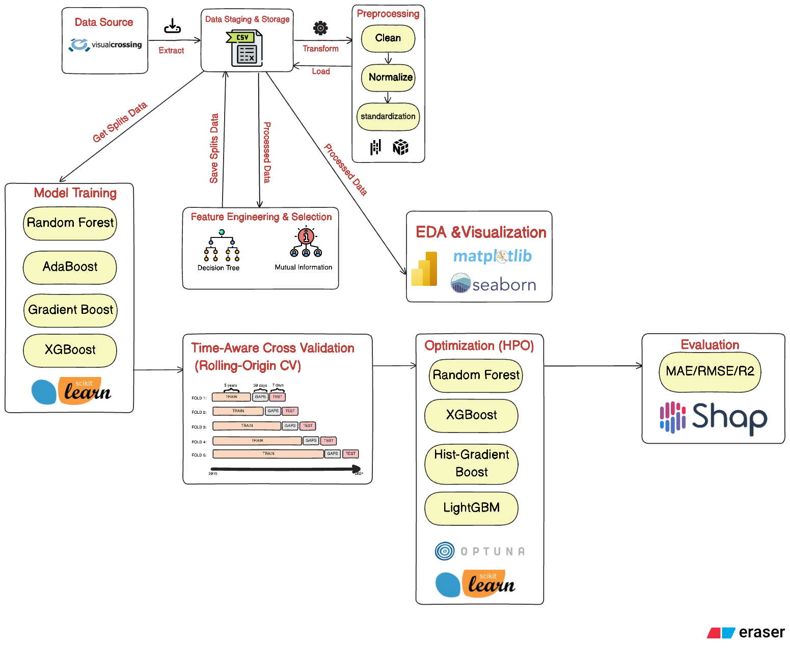
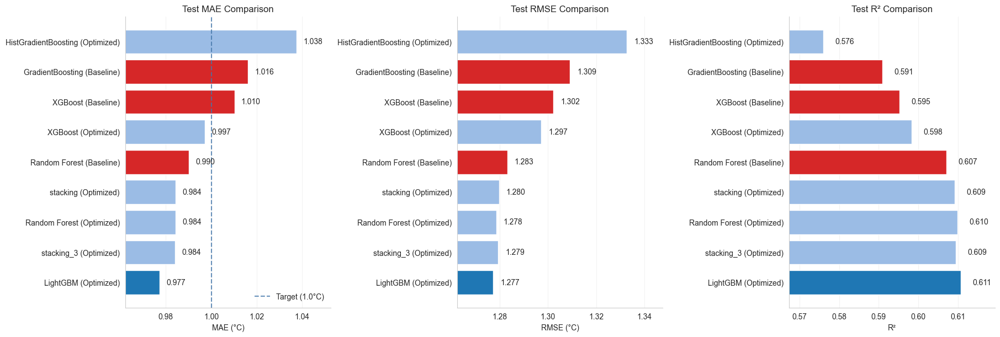
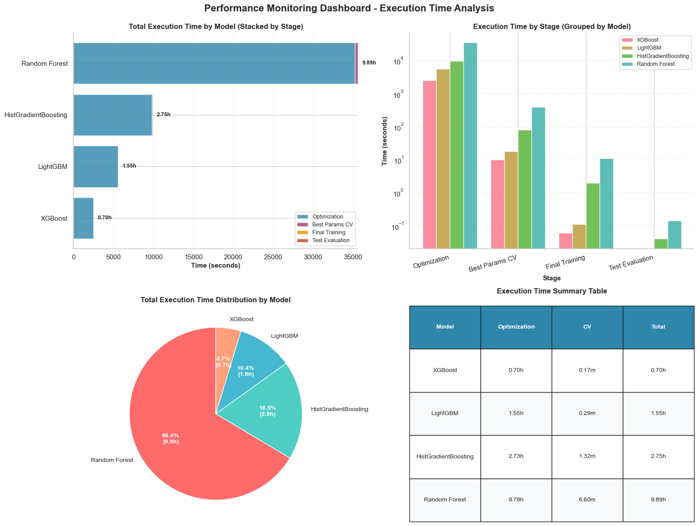
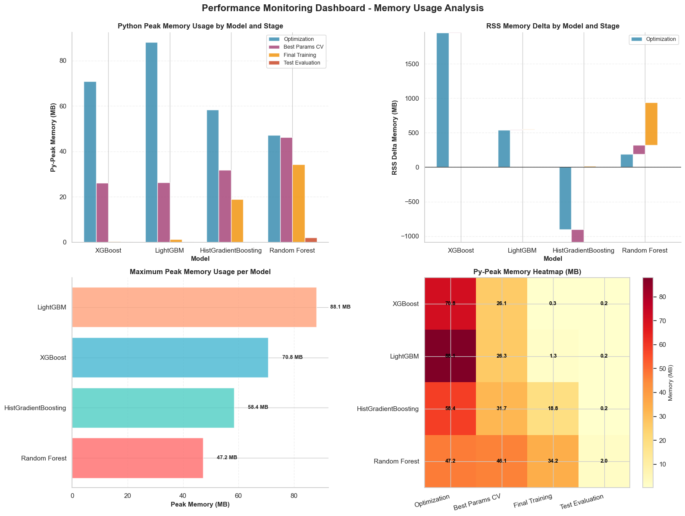
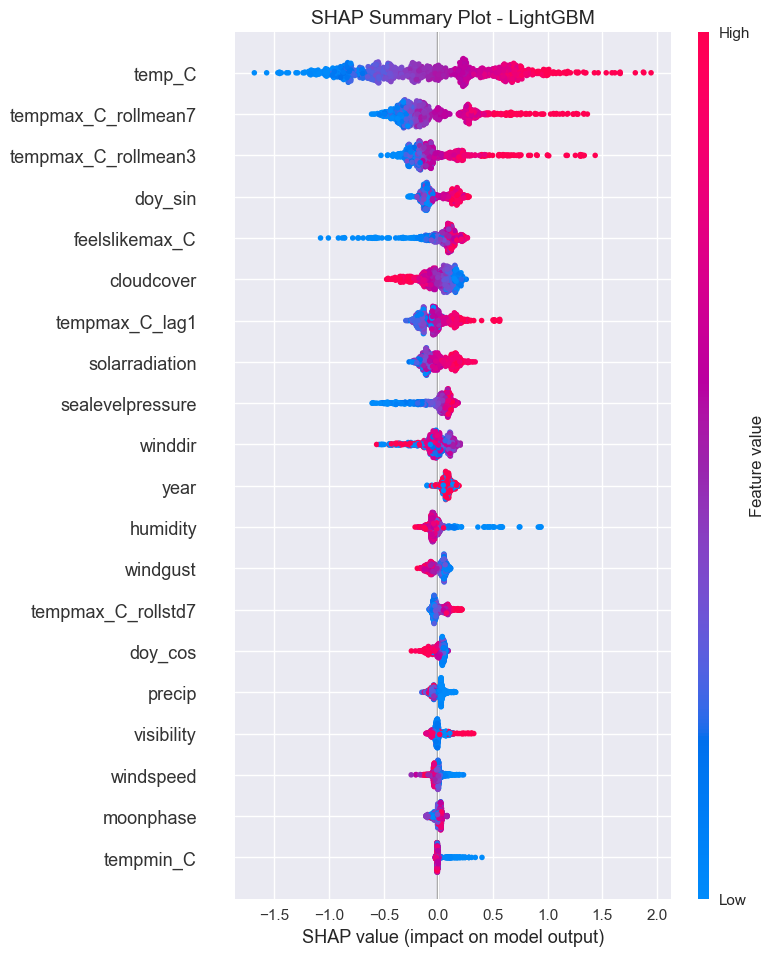
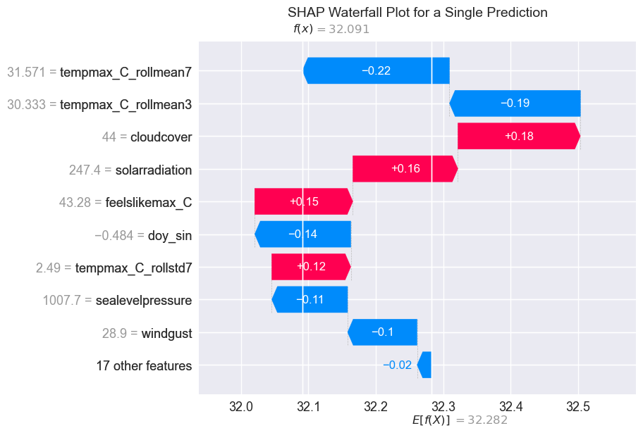

<h1 align="center">DeepThermo: Time-Series Temperature Forecasting for Southern Vietnam (2015–2025)</h1>

<p align="center"><i>Predicting Tomorrow’s Heat, Today’s Innovation</i></p>

<p align="center">
  <!-- last commit -->
  
  <!-- giả lập tỷ lệ notebook -->
  
  <!-- số ngôn ngữ -->
  
</p>

<p align="center"><i>Built with the tools and technologies:</i></p>

<p align="center">
  
  
  
  
  
  
  
</p>

<p align="center">
  
  
  
</p>

## 📘 Overview

**DeepThermo** is an end‑to‑end machine learning system designed to forecast the **next-day maximum temperature** for 18 provinces across Southern Vietnam using 10 years of historical weather data (2015–2025).  
It unifies data preprocessing, feature engineering, model training, hyperparameter optimization, and evaluation into a clean, reproducible workflow suitable for both research and production.

Southern Vietnam experiences highly dynamic tropical weather, making accurate temperature forecasting essential for agriculture, energy planning, public services, and daily life.  
This project addresses that need by leveraging modern ML techniques and robust time‑series validation.

**What makes DeepThermo stand out?**

- 🧪 **Model Benchmarking & Optimization** — Evaluate and tune multiple ensemble models (XGBoost, LightGBM, Random Forest, Gradient Boosting, AdaBoost) using date‑aware cross‑validation and Optuna.
- ⚙️ **Reproducible Pipelines** — Automated workflows for preprocessing, feature engineering, model comparison, and result tracking ensure consistency across experiments.
- 📊 **Insightful Visual Analytics** — Built‑in utilities generate plots for feature importance, model diagnostics, performance curves, and error distributions.
- 🚀 **Deployment‑Ready Artifacts** — Exported models, schemas, and metadata make integration into production or FastAPI services seamless.
- ⏱️ **Time‑Series Reliability** — Implements rolling‑origin validation tailored specifically for temporal data to avoid leakage and ensure robust generalization.
- 🛠️ **Performance Monitoring** — Tracks training time, memory usage, and resource profiles throughout the pipeline.



The goal is to provide a powerful, transparent, and extensible framework for temperature forecasting — enabling developers, students, and researchers to build accurate and interpretable climate‑related ML systems.

## 🌟 Highlights

- **High‑Accuracy Forecasting** — Achieves sub‑1°C MAE using optimized ensemble models on real-world weather data.
- **Robust Time‑Series Validation** — Rolling‑Origin CV ensures no leakage and realistic model evaluation.
- **10‑Year Regional Dataset** — Covers 18 provinces with >70,000 cleaned weather records.
- **Strong Interpretability** — SHAP-driven pipeline reveals transparent, trustworthy predictions.
- **Production‑Ready Artifacts** — Fully exportable models, schemas, feature lists, and evaluation reports.
- **End‑to‑End Workflow** — From raw data → preprocessing → FE → training → HPO → evaluation → export.

## ✨ Features

- **📊 Comprehensive Data Analysis**: Exploratory data analysis with 70,000+ weather records
- **🔧 Advanced Preprocessing**: Missing value handling, outlier detection, data quality assessment
- **⚡ Feature Engineering**: Temporal features, lag features, rolling statistics, seasonal patterns
- **🤖 Multiple ML Models**: Random Forest, XGBoost, Decision Tree, Gradient Boosting
- **🎛️ Hyperparameter Optimization**: Automated tuning using Optuna
- **📈 Model Evaluation**: Comprehensive metrics (MAE, RMSE, R²)
- **📊 Visualization**: Model comparison charts, performance metrics, data insights
- **🚀 Production Ready**: Modular scripts, configuration management, logging
- **📝 Documentation**: Complete documentation and usage examples


### 🔍 Extended Features

- **🧩 Time‑Series Aware Splitting**  
  Implements Rolling‑Origin Cross‑Validation (ROCV) with gap, horizon, and minimum training window to prevent data leakage and improve generalization.

- **📦 Dataset Versioning & Artifacts**  
  Automatically exports:
  - Train/Val/Test splits  
  - Feature schemas  
  - Model metadata  
  - Optuna study database  
  - Final trained models  

- **🧠 Interpretability with SHAP**  
  Provides:
  - Global importance plots  
  - SHAP beeswarm  
  - Dependence plots  
  - Local explanations (force/waterfall)  

- **🛠 Modular Codebase**  
  Clearly separated modules:
  - `preprocessing/`
  - `feature_engineering/`
  - `models/`
  - `evaluation/`
  - `utils/` (rolling CV, scoring, visualization)

- **🧵 Reproducibility**  
  Full seed control for NumPy, Python, Optuna, and model libraries.

- **📡 Ready for Deployment**  
  Supports rapid integration with:
  - FastAPI endpoints  
  - Batch inference pipelines  
  - Scheduled retraining workflows  

- **🧭 Diagnostic Tools**  
  Includes:
  - Residual analysis  
  - Error distribution  
  - Province‑level performance breakdown  
  - Seasonal evaluation  
  - Prediction vs. actual overlays  

- **📈 Experiment Tracking (Optional)**  
  Native integration with Weights & Biases for:
  - Metric logging  
  - Hyperparameter sweeps  
  - Resource monitoring  
  - Artifact storage


## 🧮 Model Comparison

| Model                     | Validation MAE | Test MAE | Test RMSE | Test R² |
|---------------------------|----------------|----------|-----------|---------|
| **LightGBM (Best)**       | 0.893     | **0.9772** | **1.2772**    | **0.6106** |
| Stacking (Optimized)      | ____         | 0.9843   | 1.2793    | 0.6094 |
| Stacking v3 (Optimized)   | ____        | 0.9842   | 1.2796    | 0.6092 |
| Random Forest             | 0.9341         | 0.9843   | 1.2785    | 0.6099 |
| XGBoost                   | **0.8788**         | 0.9971   | 1.2972    | 0.5983 |
| HistGradientBoosting      | 0.9360         | 1.0375   | 1.3327    | 0.5761 |

📌 *LightGBM consistently provides the best generalization across Validation and Test.*

## 📊 Results

DeepThermo delivers strong predictive performance across all evaluation datasets.  
A combination of engineered features (FE + DT) and optimized ensemble models drives high accuracy.

### 🔥 Key Outcomes

- **Best Model:** LightGBM with tuned hyperparameters  
- **Strong Runner‑Up:** Stacking ensemble models achieve accuracy extremely close to LightGBM while providing improved robustness.
- **Generalization:** Test MAE below 1°C  
- **Stability:** Very small gap between Validation and Test scores  
- **Feature Influence:** Temperature, humidity, cloud cover, visibility, and solar radiation remain dominant contributors  

### 📉 Visual Insights



The visualization summarizes performance across models, highlighting LightGBM as the top performer and stacking ensembles as highly competitive, stable alternatives.

## 📈 Performance Monitoring

DeepThermo logs performance metrics across all computation steps to ensure reliability and reproducibility.

### What We Track
- **Execution Time:** Profiling of each training & evaluation stage  
- **Memory Usage:** Peak and delta memory monitoring via psutil  
- **CPU Utilization:** Tracks multi-core efficiency during model fitting  
- **Model‑level Metrics:** MAE, RMSE, and R² logged per split and dataset  

### Visual Logs



## 🧠 SHAP Interpretability Demo

DeepThermo uses **SHAP (SHapley Additive exPlanations)** to provide transparent, human‑interpretable insights into model behavior.

### 🔍 Why SHAP?
- Understand how each feature influences predictions  
- Diagnose model bias or over-reliance  
- Explain individual predictions for debugging or reporting  
- Build trust with non-technical stakeholders  

### 📊 Global Interpretability
The global explanations highlight which features contribute most to next‑day maximum temperature predictions.



### 🌡 Local Interpretability (Per Prediction)
For a single forecast, SHAP reveals *why* the model predicts a certain temperature.



### 🧩 What We Learned from SHAP
- **Current day temperature** and **feels-like metrics** dominate predictive power  
- **Humidity**, **cloud cover**, and **solar radiation** significantly affect next‑day temperature  
- **Visibility** and **wind direction** show important contextual influence  
- **Seasonal features (sin/cos)** help capture macro‑periodicity  

These insights validate that the model aligns with real-world meteorological dynamics, increasing confidence in deployment scenarios.

## 🔧 Installation

This project uses [`uv`](https://docs.astral.sh/uv/) for fast, reproducible Python environments.

### 1️⃣ Clone the repository

```bash
git clone https://github.com/TQuang122/DeepThermo.git
cd DeepThermo
```

### 2️⃣ Install `uv` (if you haven't already)

Follow the official instructions: https://docs.astral.sh/uv/getting-started/installation/

For example on Unix-like systems:

```bash
curl -LsSf https://astral.sh/uv/install.sh | sh
```

### 3️⃣ Create and activate a virtual environment with `uv`

```bash 
uv venv
```

Activate it:

- **Linux/macOS:**
  ```bash
  source .venv/bin/activate
  ```
- **Windows (PowerShell):**
  ```powershell
  .venv\Scripts\Activate.ps1
  ```


### 4️⃣ Install dependencies with `uv sync` (using `pyproject.toml`)

All dependencies are declared in `pyproject.toml`. To install them:

```bash
uv sync
```

This will create (or update) the local environment based on the lockfile and `pyproject.toml`.  
After this, you can run notebooks or scripts (e.g. training, evaluation, API) inside the activated environment.


## 🤝 Contributing

1. Fork the repository
2. Create a feature branch (`git checkout -b feature/amazing-feature`)
3. Commit your changes (`git commit -m 'Add amazing feature'`)
4. Push to the branch (`git push origin feature/amazing-feature`)
5. Open a Pull Request

## 📝 License

This project is licensed under the MIT License - see the [LICENSE](LICENSE) file for details.

## 👥 Authors

This project is collaboratively developed by:

- **Lê Hoài Thanh Quang (SE190062)** — Project Lead & Core Developer  
- **Thái Việt Nam (SE192065)** — Data Processing & Engineering  
- **Nguyễn Tài Phúc (SE191139)** — Modeling & Evaluation  
- **Vũ Thanh Hòa (SE190222)** — Visualization & Documentation

We appreciate the contributions and collaboration that made DeepThermo possible.

## 🙏 Acknowledgments

- FPT University for providing the course framework from ADY201m
- Visual Crossing Weather data sources for the dataset
- Open source ML libraries (scikit-learn, XGBoost, pandas)
- The Python data science community

## 📞 Support

If you encounter any issues or have questions:

1. Check the [Issues](https://github.com/TQuang122/Daily_Maximum_Temperature_Forecasting_in_Southern_of_VietNam/issues) page
2. Create a new issue with detailed description
3. Contact the maintainers

---
